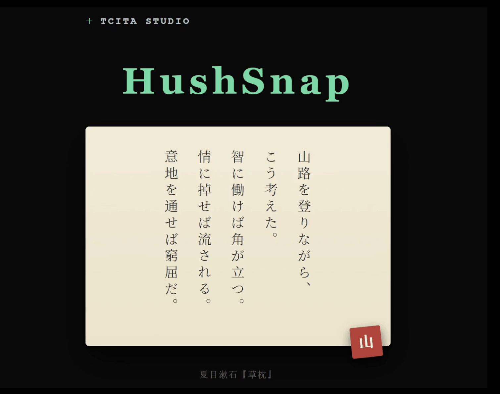
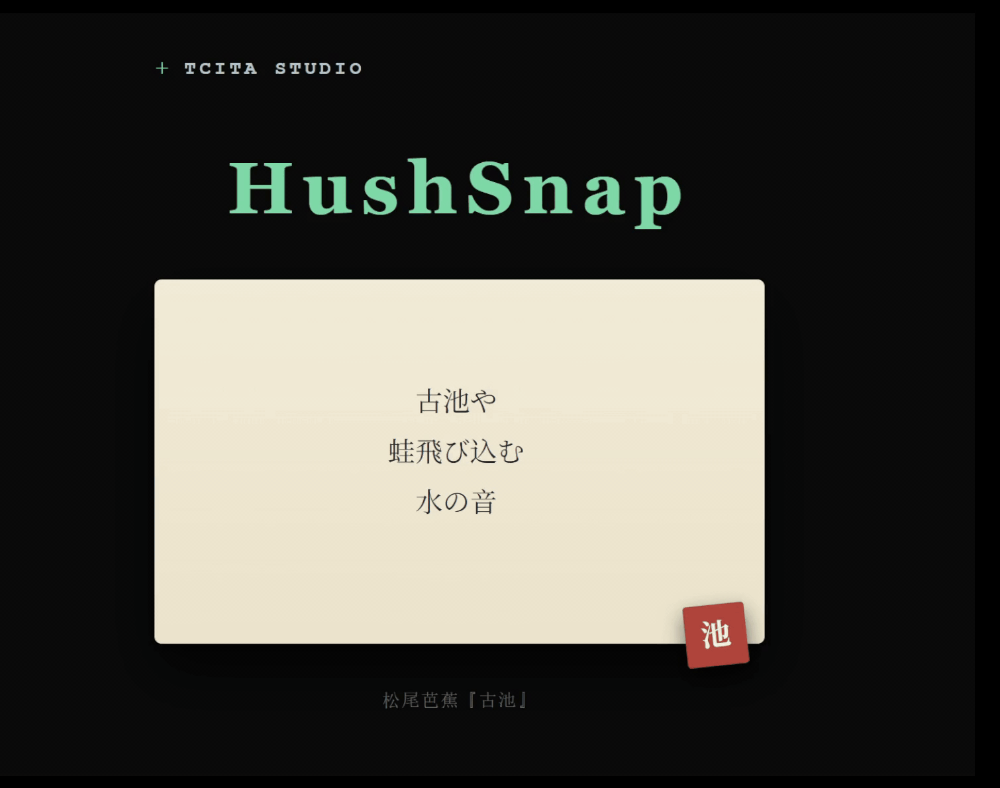
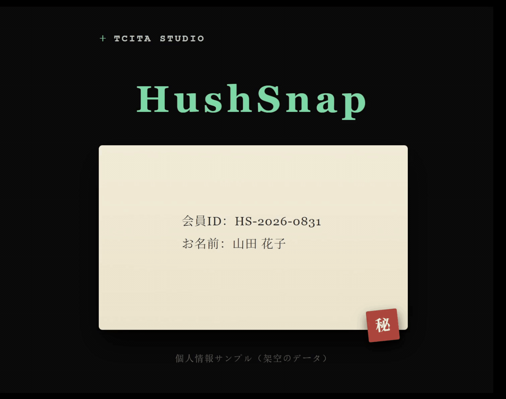

<div align="center">
  
  <h1>HushSnap</h1>
  <a href="https://apps.microsoft.com/detail/9p0qzv5z8njz">
    
  </a>
</div>

<br><br>

<table align="center" width="600">
<tr>
<td align="left">

HushSnap bridges screenshots and OCR into one fluid flow. Press a hotkey and a crosshair overlay appears instantly - select a region (or click for the full screen) and the shot lands on your clipboard right away. A thumbnail fades in at the bottom-right corner; left-click it and the recognized text pops up, already reformatted into a clean, readable layout you can edit on the spot. Everything runs locally - your screenshots and recognized text never leave your device. It lives quietly in the system tray, so there are no windows or menus to pre-launch: the UI surfaces only when you need it, then fades away.

[HushSnap Website](https://tcita.github.io/HushSnap/)

[Demo Video](https://youtu.be/untWW6_Ea3M)

[爱发电 (Support)](https://afdian.com/a/tcita)

</td>
</tr>
</table>

<table>
  <tr>
    <td align="center"><b>Click thumbnail → OCR</b></td>
    <td align="center"><b>Drag thumbnail → Save</b></td>
    <td align="center"><b>Edit → Redact</b></td>
  </tr>
  <tr>
    <td></td>
    <td></td>
    <td></td>
  </tr>
</table>

After capture, a thumbnail fades in at the bottom-right corner of your screen. This thumbnail is the heart of HushSnap's post-capture flow:

- **Hover** to pause auto-hide and reveal an action pill with **Edit**, **Pin**, and **Close** buttons.
- **Drag and drop** the thumbnail anywhere to save the image - into a chat, an email, a folder, or another app.
- **Left-click** the thumbnail to run **OCR**. Recognized text opens in a floating popup where you can edit, copy, resize, or pin the window to keep it visible.
- **Edit** (the brush button on the action pill) opens the built-in **image editor** - see [Image Editor](#image-editor) below for the full toolset.
- **Right-click** the thumbnail for **View Original** (open the capture in your default viewer), **Copy Image** to clipboard, or **Save to Desktop**.
- Optionally overlay a decorative **vine ornament** on the thumbnail’s top-left corner (enable it in Settings - Capture). It is purely cosmetic; it does not change the thumbnail’s hit area or any behavior.
- Enable **Background OCR Prefetch** in Settings to run OCR quietly after each capture so the thumbnail popup opens faster.


## Release Notes

See [**what's new.txt**](what's%20new.txt) for the full changelog (Simplified Chinese, Traditional Chinese, English, Japanese — newest first).


As the project continues to evolve, some parts of this README may occasionally lag behind the latest behavior or features.

## Image Editor

The built-in image editor opens from the thumbnail's **Edit** button, or from the right-click menu on a pinned image. It's a lightweight, dark-themed window for touching up a capture before sharing - annotate, redact, crop, rotate, resize, then copy to clipboard or save. The window opens centered on the cursor's screen and remembers its size across sessions.

**Tools:** rectangle / ellipse / line (color, size, fill, optional arrowhead), text (font, size, color), brush, highlighter, mosaic (pixelate/redact), eraser, pan, and the crop / rotate / resize transforms. Plus undo/redo (`Ctrl+Z` / `Ctrl+Y`), fit-to-viewport (`Ctrl+0`), copy, and Save As… (`Ctrl+S`, PNG / JPEG / BMP). Transforms run as atomic sessions - **Esc** cancels - so the state stays unambiguous mid-edit.


## OCR Engine

HushSnap uses [**PP-OCRv6**](https://github.com/PaddlePaddle/PaddleOCR) as its sole OCR engine:

- **PP-OCRv6 (via RapidOCR):** Runs PP-OCRv6 small ONNX models in-process via the [`rapidocr`](https://github.com/RapidAI/RapidOCR) Python package (Apache 2.0). No external dependencies or language packs needed. Works offline. Uses a unified multilingual model covering **50 languages** in a single 7.7M-parameter model - surpassing the accuracy of the previous-generation v5 server model at a fraction of the size.

The engine supports the following 50 languages out of the box:

**Core:** Simplified Chinese, Traditional Chinese, English, Japanese

**Latin-script (46):** French, German, Italian, Spanish, Portuguese, Dutch, Polish, Romanian, Czech, Swedish, Norwegian, Danish, Finnish, Hungarian, Turkish, Vietnamese, Indonesian, Malay, Azerbaijani, Afrikaans, Bosnian, Croatian, Welsh, Estonian, Irish, Icelandic, Kurdish, Lithuanian, Latvian, Maltese, Māori, Occitan, Slovak, Slovenian, Albanian, Swahili, Tagalog, Uzbek, Latin, Serbian (Latin), Catalan, Basque, Galician, Luxembourgish, Romansh, Quechua

### Minimal cv2 build

The shipped MSIX is slimmed down: HushSnap uses a purpose-built **24.8 MB static `cv2.pyd`** instead of the official 82 MB `opencv-python` wheel — 70% smaller, OCR output byte-identical (this is a size optimization only; the standard pip wheel works too). The trimmed package is committed in the repo (`third_party/` binary + the `cv2/` package at repo root, which dev and tests import directly). Rebuild when OpenCV or Python changes:

```powershell
pwsh scripts/build/build_minimal_opencv.ps1 -NoIPP -ForceClean
```

## Third-Party Acknowledgment

Design references: [Text-Grab](https://github.com/TheJoeFin/Text-Grab) (MIT,
OCR workflow), [Pinta](https://github.com/PintaProject/Pinta) (MIT, image editor
toolset), [ShareX](https://github.com/ShareX/ShareX) (GPL-3.0, capture workflow).
Built with [PyQt6](https://www.riverbankcomputing.com/software/pyqt/) (GPL-3.0-only,
© Riverbank Computing Limited) — see `THIRD_PARTY_NOTICES.md` for all attributions.

## License

HushSnap is distributed under the **GNU General Public License v3.0**
([LICENSE.md](LICENSE.md)). See `THIRD_PARTY_NOTICES.md` for third-party
attribution.

Copyright © 2026 HushSnap.

## Development & Debugging

Install dependencies:

```powershell
pip install -r requirements.txt
```

Run from source:

```powershell
python HushSnap.py
```

To enable debug mode, set `debug = true` in `hushsnap_config.toml` (the `--debug` CLI flag was removed because MSIX packages cannot receive command-line arguments).

**Key Features of Debug Mode:**

- **Isolation:** Running from source uses `%LOCALAPPDATA%\HushSnap_Dev`, ensuring your production settings remain untouched.
- **Traceability:** Sets log level to `DEBUG` and opens the log folder immediately upon startup.
- **Live Output:** Real-time logs are streamed to the terminal via the logging console handler (`StreamHandler`).
- **OCR Inspection:** Debug mode saves detection-box images to the data directory. Right-click the tray icon → "Config Folder" to open this location directly.
  - `ocr_debug_words.png` - raw PP-OCR detector word boxes (red)
  - `ocr_debug_lines.png` - post-clustering line boxes (green, L0/L1/… badges)
  - Source run: `%LOCALAPPDATA%\HushSnap_Dev\`
  - Packaged run (MSIX): `%LOCALAPPDATA%\Packages\<PackageFamilyName>\LocalState\`
  - Packaged run (PyInstaller standalone): `%LOCALAPPDATA%\HushSnap\`

## Building (MSIX)

```powershell
build_msix.bat              # build unsigned MSIX; version auto-resolved from git tag
sign_for_local_test.bat     # self-sign the package for local install testing
```

The build requires HEAD at a git tag (e.g. `v0.3.0`). For local testing, `sign_for_local_test.bat` auto-creates a self-signed certificate and trusts it - run as Administrator.

Every release is tagged in git — `git checkout v1.5.4`, run `build_msix.bat`, then `sign_for_local_test.bat` to produce a locally-installable MSIX for that version.

Release notes (four languages, newest first) are in [`what's new.txt`](what's%20new.txt). 

---

## Installation

HushSnap is distributed exclusively through the [Microsoft Store](https://apps.microsoft.com/detail/9p0qzv5z8njz).

